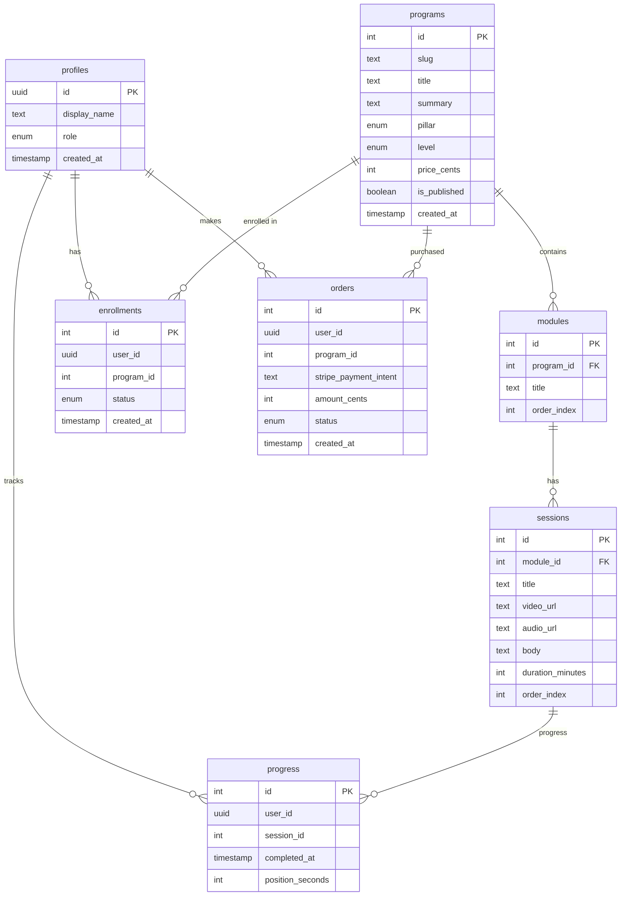

# Free The Brave App

This repository contains the code for a wellness ‑education web app aligned to the kaupapa pillars – Tinana (Body), Aroha/Hinengaro (Mind & Love), Wairua (Spirit), and Whānau/Hapori (Community). The app provides courses and membership features with a clean, mobile‑first UI.

## Tech Stack

- Next.js (App Router) with TypeScript
- TailwindCSS + shadcn/ui for UI components
- Supabase (Postgres) for database & Auth
- Prisma ORM
- Stripe (test mode) for payments
- Vercel for deployment

## Getting Started

1. Clone the repository:

```
git clone https://github.com/moseslovesemail/free-the-brave-app.git
cd free-the-brave-app
```

2. Install dependencies:

```
npm install
# or
yarn install
```

3. Create a `.env.local` file at the project root and add the following environment variables:

```env
NEXT_PUBLIC_SUPABASE_URL=your_supabase_url
NEXT_PUBLIC_SUPABASE_ANON_KEY=your_supabase_anon_key
SUPABASE_SERVICE_ROLE_KEY=your_supabase_service_role_key
DATABASE_URL=your_supabase_database_url
STRIPE_SECRET_KEY=your_stripe_secret_key
NEXT_PUBLIC_STRIPE_PUBLISHABLE_KEY=your_stripe_publishable_key
STRIPE_WEBHOOK_SECRET=your_stripe_webhook_secret
```

4. Run the development server:

```
npm run dev
```

5. Open [http://localhost:3000](http://localhost:3000) in your browser to see the app.

## Deploying

The app is configured to deploy to Vercel. Create a new project in Vercel, link it to this GitHub repository, and add the environment variables above in the Vercel dashboard. On push to `main`, Vercel will build and deploy automatically.

## Schema



## Next Steps

See `Backlog.md` for tasks that remain for the MVP, including:

- Build program catalog and filters
- Implement Supabase Auth (email / magic link)
- Protect dashboard and admin routes
- Integrate Stripe checkout
- Admin CRUD for Programs / Modules / Sessions
- Implement progress tracking & enrolment flows
- Accessibility audit & improvements
